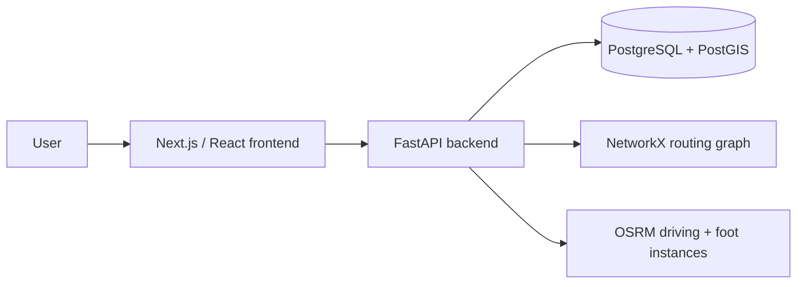

# Kathmandu Bus Route Finder

A web-based public transport navigation system for the Kathmandu Valley. Riders enter an origin and destination stop and get a direct or single-transfer bus route — with road-following geometry, walking connections, and historical traffic-congestion overlays — rendered on an interactive map.

BE Minor Project — Department of Electronics & Computer Engineering, IOE Pulchowk Campus.

**Team:** Dinesh Bhatta (080BCT025) · Dipesh S Saud (080BCT026) · Janak S Pujara (080BCT035)

## Overview

Kathmandu's public bus network has no unified digital route-finding tool — riders rely on word of mouth or informal route lists. This project builds a searchable, map-based route finder: pick an origin and destination stop (by name, or by detecting your current location), and the app returns the best route — direct where possible, with a single walking transfer otherwise — drawn on a Leaflet map with real road/footpath geometry from OSRM.

## Features

- Bus stop search with autocomplete
- Direct route search between two stops
- Single and Multi-transfer route search (walking connection between nearby stops) when no direct route exists
- Origin/destination swap
- Current-location detection, with nearby-stop selection based on it
- Walking path from the user's location (or a chosen point) to the nearest stop
- Interactive Leaflet map: colored polylines per route leg (dashed for walking transfers), distinct origin/destination/transfer markers, and a legend
- Road-following route geometry via OSRM (falls back to straight-line segments if OSRM is unavailable)
- Historical traffic-congestion overlay — a toggleable panel showing free-flow/moderate/heavy congestion by day-of-week and time-of-day bucket, colored on the map
- Congestion-aware routing (`avoid_congestion`) and up to 2 route alternatives (`include_alternatives`) on `/route-finder`, alongside the primary result
- Distance-banded fare lookup (`GET /fare`), returned automatically alongside every `/route-finder` result
- FastAPI backend with NetworkX-based graph routing
- PostgreSQL + PostGIS spatial data layer
- Admin data-entry API and browser UI for stops, routes, route-stop ordering, and route status, gated by either a shared admin API key or a per-admin JWT login

There is no real-time GPS bus tracking or live schedules in the running app — see [Known Limitations](#known-limitations).

## System Architecture



The frontend calls the FastAPI backend over REST. The backend builds an in-memory NetworkX graph from the `stops`/`routes`/`route_stops` tables to find direct or single-transfer paths, then optionally enriches each ride leg with road-following geometry from OSRM before returning the result. Ride legs are recorded in the background afterwards to build up the historical congestion dataset. The graph is cached in memory per worker process and rebuilt lazily: a `graph_meta` table holds a version counter that every admin write bumps, and every request cheaply checks it against what the current process last built from -- so cache invalidation works correctly even across multiple worker processes/replicas, not just the one that happened to handle a given admin write.

## Tech Stack

| Layer      | Tech                                  |
|------------|----------------------------------------|
| Frontend   | Next.js 16, React 18, TypeScript, Tailwind CSS, Leaflet.js / react-leaflet |
| Backend    | Python 3.11, FastAPI 0.111, NetworkX 3.3, SQLAlchemy 2.0, Pydantic 2.7, PyJWT + passlib (admin auth) |
| Database   | PostgreSQL 15 + PostGIS 3.4 (via the `postgis/postgis:15-3.4` image — matches `docker-compose.yml` and CI) |
| Routing    | OSRM (separate driving and foot instances, road/walking-network geometry) |
| Migrations | Alembic |

## Project Structure

```
backend/     FastAPI app, SQLAlchemy models, NetworkX routing, Alembic migrations, tests
frontend/    Next.js + TypeScript + Leaflet UI
data/        Raw exports, cleaning/validation scripts, processed CSVs, schema.sql, import_data.py
docs/        Project proposal, Gantt chart, defense materials, architecture diagrams
```

See `backend/README.md` and `frontend/README.md` for the folder-level breakdown of each.

## Prerequisites

- Python 3.11
- Node.js (for Next.js 16 / npm)
- Docker (Postgres/PostGIS, and optionally OSRM)

## Local Development Setup

Fastest path (repo root, uses the `Makefile`):

```bash
git clone https://github.com/080bct026dipesh-beep/my-new-web-app.git
cd my-new-web-app
make setup       # data clean+validate, db up, migrate, CSV import, OSRM prep+up
make seed-admin  # interactive -- create the first admin login
make up          # build + start the backend (db + osrm + backend)

cd frontend && npm install && npm run dev   # separate terminal
```

> **Dev reload vs. stable image:** the backend Docker image itself runs a
> *stable* uvicorn (no `--reload`). Local dev hot-reloads through
> `docker-compose.override.yml`, which `docker compose` / `make up` pick up
> automatically — so the API restarts on file edits under `backend/` in dev,
> but a deployment that runs the image directly, or excludes the override
> (`docker compose -f docker-compose.yml up -d`), gets a normal,
> non-restarting process. `make up` always rebuilds the backend image so its
> baked pip deps stay current (the bind-mounted app code runs in dev).

Or step by step, without `make`:

```bash
# 1. Clone
git clone https://github.com/080bct026dipesh-beep/my-new-web-app.git
cd my-new-web-app

# 2. Start Postgres + PostGIS
docker compose up -d db

# 3. Backend
cd backend
python -m venv venv && source venv/bin/activate   # Windows: venv\Scripts\activate
pip install -r requirements.txt -r requirements-dev.txt   # add -dev to run pytest locally
cp .env.example .env
alembic upgrade head          # applies the full migration chain (see below)
cd .. && python data/scripts/import_data.py && cd backend  # loads the cleaned CSVs
python3 -m scripts.seed_admin # creates the first admin account
uvicorn app.main:app --reload

# 4. Frontend (separate terminal)
cd frontend
npm install
npm run dev
```

Backend runs at `http://localhost:8000` (interactive docs at `/docs`). Frontend runs at `http://localhost:3000`.

OSRM (road-following geometry) is optional for local dev — see [OSRM](#osrm) below. Full step-by-step commands, including the admin API and OSRM setup, are in `backend/README.md`.

### Running backend on host vs. inside Docker

- **On host** (`uvicorn` run directly, as above): `DATABASE_URL` should point at `localhost` — this is the default in `.env.example`.
- **Inside Docker** (`make up`, or `docker compose up -d backend`): the `backend` service in `docker-compose.yml` already sets `DATABASE_URL` to use the Compose service name `db` as the host, since containers can't reach each other via `localhost`. `make up` rebuilds the backend image before starting (so baked pip deps stay current), and dev hot-reloads via `docker-compose.override.yml` — the image itself defaults to a stable uvicorn (see the note above).

## Database Setup

PostgreSQL/PostGIS creates the empty database (via the `db` service in `docker-compose.yml`); Alembic then manages the schema inside it. These are separate steps:

```bash
docker compose up -d db      # PostgreSQL creates the ktm_bus_route_finder database
cd backend && alembic upgrade head   # Alembic creates/updates the tables inside it
```

Use `alembic upgrade head` on a **new/empty** database. Don't blindly re-run it against a database that already has a migration history you're not sure about — check `alembic current` first, since re-applying isn't idempotent for a database whose state has diverged.

The migration chain currently creates (in order): `stops`, `routes`, `route_stops` (initial schema) → replaced with the full schema (`operators`, `stops`, `routes`, `route_stops`, `route_operators`, `fare_rules`) → `admin_users` → `segment_congestion_stats` → `graph_meta` (single-row version counter for cross-process routing-graph cache invalidation). An auxiliary `route_return_leg_priority` QA table was created and later dropped.

```bash
cd backend
alembic upgrade head                          # apply all migrations
alembic revision -m "add fare column"          # create a new migration
alembic downgrade -1                           # roll back one step
```

## OSRM

The backend talks to two independent OSRM instances over HTTP:

- **Driving profile** (`OSRM_BASE_URL`, default `http://localhost:5000`) — road-following geometry for ride legs on `/route-finder`.
- **Foot profile** (`OSRM_FOOT_BASE_URL`, default `http://localhost:5001`) — pedestrian geometry for `/walking-route` ("walk to nearest stop").

Both are optional. If a leg's OSRM call fails or the service is unreachable, `/route-finder` still returns a correct route with `road_geometry: null` for that leg (the frontend falls back to a straight line), and `/walking-route` returns HTTP 502.

Each needs a one-time `.osrm` data extract built from a Nepal OSM export
first (driving and foot use separate extracts, since one `osrm-routed`
process only serves the profile it was extracted with): `make osrm`
(repo root) does this idempotently for both profiles — see
`backend/scripts/prepare_osrm_data.sh` and `backend/README.md` for the
manual `osrm-extract` / `osrm-partition` / `osrm-customize` equivalent if
you're not using `make`. Then `make osrm-up`, or
`docker compose up -d osrm osrm-foot` directly.

## Running the Application

```bash
# Backend
cd backend
uvicorn app.main:app --reload   # host dev; inside Docker use `make up` instead

# Frontend
cd frontend
npm run dev
```

## API

Interactive OpenAPI/Swagger docs are available at `http://localhost:8000/docs` once the backend is running. Key endpoints (see `backend/app/api/`):

| Method | Path | Purpose | Auth |
|---|---|---|---|
| GET | `/health` | Liveness check | — |
| GET | `/stops` | List stops | — |
| GET | `/stops/nearby` | Nearest stops to a lat/lng | — |
| GET | `/routes` | List routes | — |
| GET | `/routes/{route_id}` | Route detail | — |
| GET | `/routes/{route_id}/stops` | Ordered stops on a route | — |
| GET | `/route-finder` | Find a route between an origin and destination `stop_id` (direct, else single-transfer; `avoid_congestion`/`include_alternatives` query params) | — |
| GET | `/walking-route` | Foot-profile route between two coordinates (e.g. to the nearest stop) | — |
| GET | `/fare` | Distance-banded fare lookup | — |
| GET | `/congestion` | Historical congestion by day-of-week / hour-bucket (defaults to now, Nepal time) | — |
| GET | `/congestion/buckets` | The fixed set of valid hour buckets | — |
| POST | `/stops` | Create a stop | `require_admin` |
| POST | `/routes` | Create a route | `require_admin` |
| POST | `/routes/{route_id}/stops` | Append a stop to a route | `require_admin` |
| DELETE | `/routes/{route_id}/stops/{sequence_no}` | Remove a stop and resequence | `require_admin` |
| PATCH | `/routes/{route_id}/stops/order` | Reorder a route's stops (permutation of current `sequence_no` values) | `require_admin` |
| PATCH | `/routes/{route_id}/status` | Update a route's status | `require_admin` |
| POST | `/graph/reload` | Force-rebuild the cached routing graph | `require_admin` |
| POST | `/admin/login` | Log in an `AdminUser`, returns a JWT | — |

`require_admin` accepts either the shared `X-Admin-Api-Key` header or a bearer JWT from `POST /admin/login` — see [Admin/Data Management](#admindata-management) below.

## Routing Algorithm

For a given origin/destination `stop_id` pair, `backend/app/routing/pathfinder.py`:

1. **Direct route search** — scans every active route for one that contains both stops (checking all occurrences, so loop routes work correctly), and, if the route is marked bidirectional, both directions of travel. If more than one direct route qualifies, the shortest by distance wins. A direct route always wins over a multi-route path.
2. **Transfer search (fallback)** — if no direct route exists, falls back to a NetworkX Dijkstra shortest-path search over a graph where each ride node is `(stop_id, route_id, sequence_no)` (so repeated stops on loop routes stay distinct), with `board`/`alight`/`ride` edges per route and `walk` edges between different physical stops within `INTERCHANGE_DISTANCE` (100 m) of each other. Boarding a route costs a fixed `TRANSFER_PENALTY` (3000, in the same distance units as edge weights) so Dijkstra prefers fewer transfers over marginal distance savings.
3. **Geometry** — each ride leg's stop sequence is sent to OSRM as waypoints (thinned to a minimum 80 m spacing to avoid OSRM zig-zagging between nearly-adjacent stops) to get road-following polylines; walking transfer legs are rendered as straight lines by the frontend.
4. **Congestion recording** — after the response is sent, each ride leg with real OSRM geometry is recorded as a sample into `segment_congestion_stats`, bucketed by day-of-week and 3-hour time bucket (Nepal time), feeding the `/congestion` endpoint.

The routing graph is cached per worker process and rebuilt automatically whenever a `graph_meta.version` bump (from any admin write that changes graph shape, or a manual `/graph/reload` call) is newer than what that process last built from -- see [System Architecture](#system-architecture) above.

## Data Pipeline

```
data/raw/  →  scripts/clean_data.py  →  data/processed/*_clean.csv  →  schema.sql + scripts/import_data.py  →  PostgreSQL/PostGIS  →  routing graph
```

`scripts/clean_data.py` removes orphaned `route_stops`, re-sequences stop order per route, recomputes each route's `start_stop_id`/`end_stop_id`/`total_stops`, resolves or nulls `operator_id`, flags distance outliers, and checks for orphan `route_operators`/`operators` pairs — writing validated CSVs plus a `processed/report.md` describing exactly what changed. `scripts/validate_clean.py` re-runs the same integrity checks against the CSVs with no database required. `schema.sql` then builds the schema (via Alembic) and `scripts/import_data.py` loads the CSVs via `COPY` in dependency order, ending with a built-in referential-integrity sanity check. `make data` / `make import` (repo root) run the two scripts for you. See `data/README.md` and `data/scripts/README.md` for full detail and current dataset row counts.

## Testing

Backend tests use **pytest**:

```bash
cd backend
pytest -v
```

- `tests/test_routing.py`, `tests/test_pathfinder_alternatives.py`, `tests/test_stop_positioning_adversarial.py` — unit tests for graph construction, the pathfinder (bidirectional/one-directional edges, transfer edges, direct-vs-transfer preference, graph caching, route alternatives), and the stop-placement heuristics (closed-loop / ring-road routes, snap-radius-constrained failures, monotonic-cursor regressions), no database required.
- `tests/test_congestion_weight_fn.py`, `tests/test_duration_weight_fn.py`, `tests/test_congestion_zones.py` — unit tests for the congestion-aware and estimated-duration edge-weighting functions used by `avoid_congestion` and the `fastest_estimated` alternative.
- `tests/test_stops.py`, `tests/test_stops_api.py`, `tests/test_route_finder_api.py`, `tests/test_route_geometry_api.py`, `tests/test_admin_route_status.py` — integration tests against a live database; they skip cleanly if Postgres isn't reachable (`docker compose up -d db` + `alembic upgrade head` first).
- `tests/test_admin_auth_api.py`, `tests/test_fare_api.py`, `tests/test_admin_crud_api.py` — self-contained coverage for `POST /admin/login` (including the 5/minute rate limit and timing-safe error parity), `GET /fare` band matching, and the admin data-entry endpoints (`POST /stops`, `POST /routes`, `POST /routes/{id}/stops`, `DELETE /routes/{id}/stops/{seq}`, `PATCH /routes/{id}/stops/order`), each creating and tearing down its own fixtures rather than depending on the shipped dataset.
- CI (`.github/workflows/ci.yml`) runs the full suite against a real `postgis/postgis:15-3.4` container on every PR.

Frontend tests use **Vitest + React Testing Library**:

```bash
cd frontend
npm test          # single run, used in CI
npm run test:watch
```

Covers `lib/` (pure helpers plus the `fetch` wrapper in `lib/api.ts`, with `fetch` mocked) and `hooks/` (via `renderHook`, with `lib/api` mocked) — see `frontend/README.md` for the full breakdown. CI's `frontend-checks` job runs `npm test` between lint and build.

The data pipeline also has its own CI job, `data-pipeline-tests`: it runs `data/scripts/test_clean_data.py`, then re-runs `clean_data.py --fail-on-verify-error` and `validate_clean.py` against the committed raw data on every PR, so a regression in the cleaning/validation logic can't slip in unnoticed.

## Environment Variables

Set in `backend/.env` (see `backend/.env.example`):

| Variable | Required | Purpose |
|---|---|---|
| `DATABASE_URL` | Yes | Postgres connection string |
| `CORS_ORIGINS` | No (defaults to the local Next.js dev origin) | Comma-separated allowed frontend origins |
| `ADMIN_API_KEY` | Yes (no default) | Shared secret for the `X-Admin-Api-Key` data-entry endpoints |
| `JWT_SECRET_KEY` | Yes (no default) | Signs `AdminUser` login JWTs |
| `OSRM_BASE_URL` | No (defaults to `http://localhost:5000`) | Driving-profile OSRM instance |
| `OSRM_FOOT_BASE_URL` | No (in code, falls back to `OSRM_BASE_URL` if unset — `.env.example` sets it explicitly to `http://localhost:5001`) | Foot-profile OSRM instance |

## Admin/Data Management

The data-entry endpoints (`POST /stops`, `POST /routes`, `POST /routes/{id}/stops`, `DELETE /routes/{id}/stops/{seq}`, `PATCH /routes/{id}/stops/order`, `PATCH /routes/{id}/status`, `POST /graph/reload`) are behind `require_admin`, which accepts **either** of two credentials:

- **`X-Admin-Api-Key` header** — one shared secret, for scripted/ETL callers.
- **JWT via `POST /admin/login`** — authenticates an `AdminUser` account (seeded with `python3 -m scripts.seed_admin`) and returns a bearer token, attaching that specific admin to the request for future per-admin authorization/audit use. Rate-limited to 5 requests/minute per IP.

New `stop_id`/`route_id` values are server-generated, not caller-supplied. See `backend/README.md` for details.

The frontend exposes a browser-based data-entry UI at `/admin` (link in the nav bar): sign in with the per-admin JWT, then create stops/routes and manage each route's stop sequence (add, in-place reorder, remove) and status from the map app itself. The `DELETE`/`PATCH` methods are why the backend CORS allow-list includes both of those verbs.

## Known Limitations

- No real-time bus location/GPS tracking or live schedules — routing is based on the static stop/route dataset, and the congestion overlay is historical (day-of-week/time-bucket averages), not live traffic.
- Route geometry depends on OSRM being reachable; without it, legs fall back to straight-line segments.
- Dataset coverage and field verification vary by record — see `data/README.md` / `data/processed/README.md` for current caveats (e.g. fare figures are a desk estimate, not yet field-verified).

## Future Improvements

Not implemented — potential future work:

- Real-time bus location tracking
- Live traffic-aware routing (beyond the current historical congestion overlay)
- ETA estimation
- Expanded dataset coverage
- Route reliability metrics

PWA support (installable manifest + app icons, offline-capable app shell,
stale-while-revalidate caching for `/stops` `/routes` `/congestion`) and
mobile responsiveness have both since been implemented — see
`frontend/public/sw.js` and `frontend/app/manifest.ts`.

## Team

Dinesh Bhatta (080BCT025) · Dipesh S Saud (080BCT026) · Janak S Pujara (080BCT035) — BE Minor Project, Department of Electronics & Computer Engineering, IOE Pulchowk Campus.

Task ownership and day-to-day workflow are documented in `CONTRIBUTING.md`. Team tasks are tracked in Jira (Scrum board, 3 sprints, 7 epics); see `docs/` for the project proposal and Gantt schedule.

## License

See `LICENSE`.
